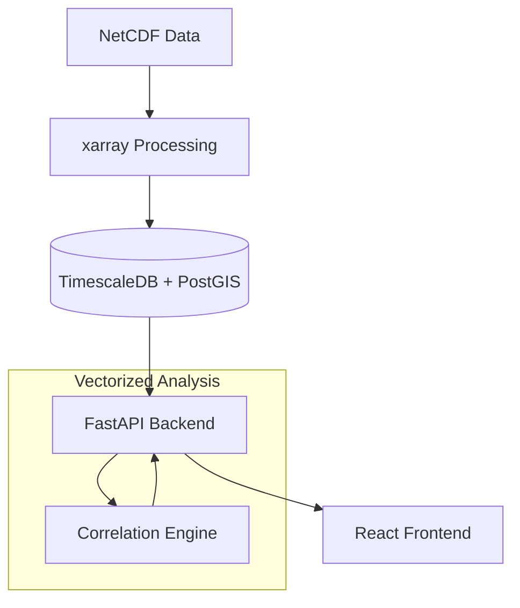

# 🌧️ Rainfall Complimentary Engine

> **A High-Performance Spatio-Temporal Analysis Platform for Global Precipitation Patterns.**

The **Rainfall Complimentary Engine** is a state-of-the-art analytical system designed to identify, correlate, and visualize global rainfall patterns. By leveraging high-resolution historical proxy data and vectorized correlation algorithms, it uncovers "complementary" regions—geographies where rainfall patterns exhibit strong inverse or lagged relationships, critical for climate research and agricultural planning.

---

## 🚀 Key Features

- **Vectorized Correlation Engine**: High-performance NumPy-based Pearson correlation computation across global grid points.
- **Spatio-Temporal Intelligence**: Optimized storage using **PostGIS** for spatial geometries and **TimescaleDB** for time-series data.
- **Fluid Data Architecture**: Seamless transition from NetCDF/xarray multidimensional datasets to a dynamic web-ready API.
- **Interactive Visualization**: Real-time map rendering with MapLibre GL and historical trend analysis using Recharts.

---

## 📊 The "Points" Architecture

The system is built upon a massive dataset of spatio-temporal observations:

| Metric | Count | Description |
| :--- | :--- | :--- |
| **Spatial Points** | **~6,700** | Land-only grid points at 1.8° resolution. |
| **Temporal Points** | **504** | Monthly observations spanning 42 years (1979–2020). |
| **Total Data Points** | **~3,376,800** | Total precipitation records ingested into the engine. |

### Data Fluid Nature
Unlike static databases, our **Fluid Data Layer** treats climate indices (ONI, DMI) as dynamic drivers. The engine calculates teleconnections in real-time, allowing the UI to reflect how global phenomena like El Niño influence regional precipitation "fluidly" across the map.

---


---

## 🛠️ Technical Stack

- **Backend**: Python 3.x, FastAPI, SQLAlchemy, xarray, NumPy, SciPy.
- **Database**: PostgreSQL with PostGIS & TimescaleDB.
- **Frontend**: React 19, TypeScript, Vite, MapLibre GL, Framer Motion, Recharts.
- **Styling**: TailwindCSS with premium dark-mode aesthetics.

---

## 🏃 Getting Started

### 1. Data Engine Setup
```powershell
# Install dependencies
pip install -r data-engine/requirements.txt

# Generate mock historical data
python data-engine/scripts/create_mock_data.py

# Ingest data into the database
python data-engine/scripts/ingest_data.py

# Compute initial correlations
python data-engine/scripts/compute_correlations.py
```

### 2. Launch System
Run the unified start script to launch both the API and the Frontend:
```powershell
./start_all.ps1
```

- **API Dashboard**: `http://localhost:8000`
- **Frontend UI**: `http://localhost:5173`

---

## 📈 System Architecture



---

